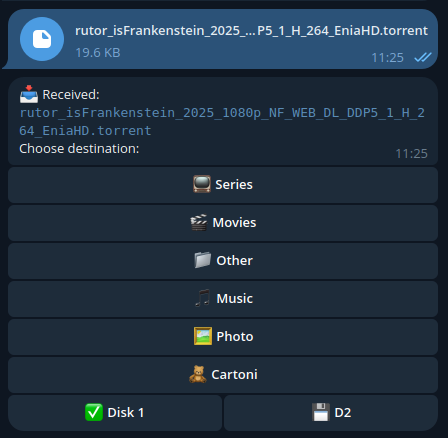
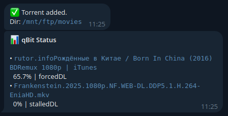

# qbot - Telegram Bot for qBittorrent

A lightweight, self-hosted Telegram bot for managing qBittorrent downloads. Send magnet links, `.torrent` files, or media directly through Telegram and organize them automatically.

## Example Screenshots





## ✨ Features

- 📥 **Add Torrents**: Send magnet links or `.torrent` files
- 📁 **Smart Organization**: Interactive disk and category selection
- 📊 **Status Tracking**: Real-time download monitoring with `/status`
- 🔔 **Notifications**: Automatic alerts on completion
- 🖼️ **Media Support**: Upload small files (<20MB) directly to your server
- 🔒 **Access Control**: User ID whitelist for security

## 📋 Prerequisites

Choose one:
- **Docker** (recommended): Docker & Docker Compose
- **Manual**: PHP 8.0+ with `php-curl` extension

## 🚀 Quick Start (Docker)

1. **Clone the repository**:
   ```bash
   git clone https://github.com/dominatos/qbittorrent-telegram-bot.git
   cd qbot
   ```

2. **Configure the bot**:
   ```bash
   cp config.php.example config.php
   nano config.php
   ```
   
   Set your:
   - Telegram Bot Token (from [@BotFather](https://t.me/botfather))
   - Allowed User IDs
   - qBittorrent WebUI credentials
   - Download paths

3. **Start with Docker**:
   ```bash
   docker-compose up -d
   ```

4. **Check logs**:
   ```bash
   docker-compose logs -f qbot
   ```

## 🛠️ Manual Installation

1. **Install dependencies**:
   ```bash
   # Debian/Ubuntu
   sudo apt install php8.2-cli php8.2-curl
   
   # Alpine
   apk add php82-cli php82-curl
   ```

2. **Configure** (see step 2 above)

3. **Run the bot**:
   ```bash
   php qbot.php
   ```

## ⚙️ Configuration

Edit `config.php` with your settings:

```php
return [
    'bot_token' => 'YOUR_BOT_TOKEN',
    'allowed_user_ids' => [123456789],
    'qb_url' => 'http://127.0.0.1:8080',
    'qb_user' => 'admin',
    'qb_pass' => 'your_password',
    'disks' => ['/downloads', '/media'],
    'categories' => [
        'movies' => '🎬 Movies',
        'tv' => '📺 TV Shows',
        // ...
    ],
    'status_show_limit' => 10,      // Max torrents in /status (0 = unlimited)
    'status_filter' => 'all',       // 'all' or 'downloading'
];
```

### Docker Volume Mounts

If using Docker, mount your download directories in `docker-compose.yml`:

```yaml
volumes:
  - /mnt/downloads:/mnt/downloads
  - /media:/media
```

### Rebuilding After Code Changes

> [!IMPORTANT]
> **Config changes** (`config.php`) take effect after restart: `docker compose restart`
> 
> **Code changes** (`qbot.php`) require rebuilding the image:
> ```bash
> docker compose down
> docker compose build --no-cache
> docker compose up -d
> ```

## 📖 Usage

1. **Send a magnet link** → Bot prompts for disk/category
2. **Upload a `.torrent` file** → Same interactive selection
3. **Check status**: Send `/status` to see active downloads
4. **Completion**: Bot notifies when downloads finish

## 🐛 Troubleshooting

### Permission Denied Errors

**Docker**:
```bash
# Fix data directory permissions
sudo chown -R 1000:1000 ./data
```

**Manual**:
```bash
# Ensure PHP can write to data directory
chmod 755 data/
chmod 644 data/bot_state.json
```

### Can't Connect to qBittorrent

1. **Check qBittorrent WebUI** is enabled (Settings → Web UI)
2. **Verify credentials** in `config.php`
3. **Docker networking**: Use `host.docker.internal` instead of `127.0.0.1` on macOS/Windows
4. **Firewall**: Ensure port 8080 is accessible

### Bot Not Responding

1. **Check bot is running**:
   ```bash
   # Docker
   docker-compose ps
   
   # Manual
   ps aux | grep qbot.php
   ```

2. **View logs**:
   ```bash
   # Docker
   docker-compose logs qbot
   
   # Manual
   tail -f data/bot.log
   ```

3. **Verify Bot Token**: Test with `curl`:
   ```bash
   curl https://api.telegram.org/bot<YOUR_TOKEN>/getMe
   ```

### Download Paths Invalid

- **Check mountpoints** exist and are writable
- **Docker**: Ensure volumes are correctly mapped in `docker-compose.yml`
- **Verify paths** in `config.php` match your system

## 🖥️ Systemd Service (Advanced)

For production deployments on Linux without Docker, use the included systemd unit file for professional process management.

### Configuration
1. **Edit the unit file**:
   ```bash
   nano qtg-torrent-bot.service
   ```
   - Replace `<USER>` with your actual Linux username in `User=`, `Group=`, `ExecStart=`, and `WorkingDirectory=`.
   - Ensure the path correctly points to your `qbot.php` script.

2. **Install the service**:
   ```bash
   sudo cp qtg-torrent-bot.service /etc/systemd/system/
   sudo systemctl daemon-reload
   sudo systemctl enable --now qtg-torrent-bot
   ```

### Management
- **Check Status**: `sudo systemctl status qtg-torrent-bot`
- **View Logs**: `sudo journalctl -u qtg-torrent-bot -f`
- **Restart**: `sudo systemctl restart qtg-torrent-bot`

### Security Hardening Included
The service file comes pre-configured with security best practices:
- `ProtectSystem=full`: Makes `/usr`, `/boot`, and `/etc` read-only for the service.
- `PrivateTmp=true`: Sets up a private `/tmp` directory.
- `NoNewPrivileges=true`: Ensures no child processes can gain more privileges than the parent.
- `Restart=always`: Automatically restarts the bot if it crashes.

## 📁 Project Structure

```
qbot/
├── qbot.php                  # Main bot script
├── config.php                # Your configuration (not in repo)
├── config.php.example        # Configuration template
├── Dockerfile                # Alpine-based container
├── docker-compose.yml        # Docker orchestration
├── data/                     # State and logs (auto-generated)
│   ├── bot_state.json
│   └── bot.log
└── qtg-torrent-bot.service   # Systemd unit file
```

## 📄 License

MIT License - See LICENSE file for details

---

**Made with ❤️ for self-hosters**
