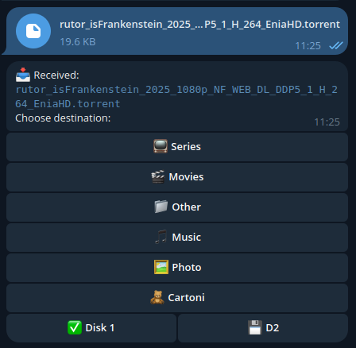
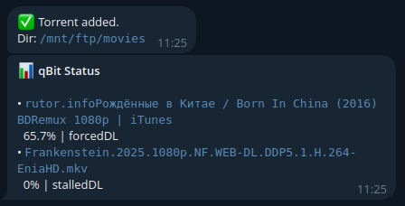
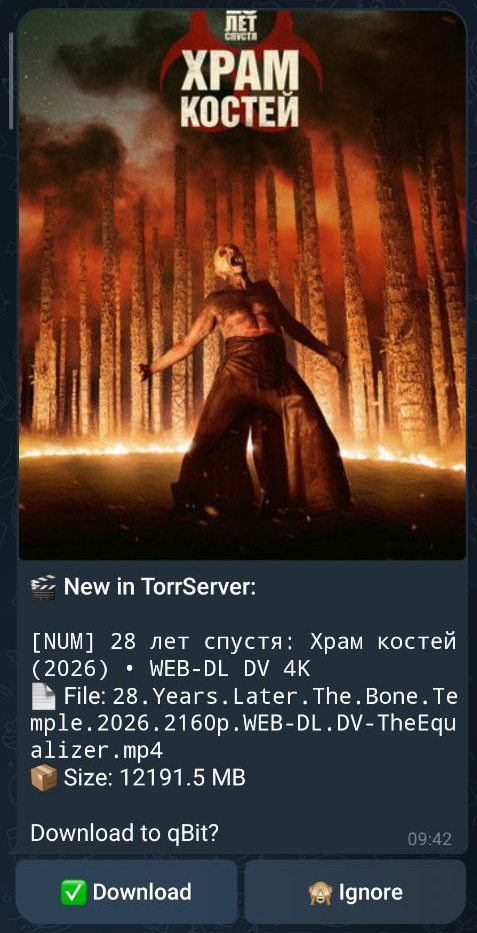

# qbot - Telegram Bot for qBittorrent

A lightweight, self-hosted Telegram bot for managing qBittorrent downloads. Send magnet links, `.torrent` files, video URLs (YouTube, Vimeo, etc.), or media directly through Telegram(limit 20mb for files) and organize them automatically.

## Example Screenshots






## ✨ Features

- 📥 **Add Torrents**: Send magnet links or `.torrent` files
- 🎬 **yt-dlp Downloads**: Send YouTube/Vimeo/Twitter/etc. URLs for direct video downloads
- 📁 **Smart Organization**: Interactive disk selection showing **Available Space**
- 📊 **Status Tracking**: Real-time download monitoring with `/status`
- 🔔 **Notifications**: Automatic alerts on completion
- 🎬 **TorrServer Integration**: Rich notifications with **posters**, file names/sizes, and automatic **speed limits**
- 🔒 **Access Control**: User ID whitelist for security

## 📋 Prerequisites

Choose one:
- **Docker** (recommended): Docker & Docker Compose
- **Manual**: PHP 8.0+ with `php-curl` extension, plus `yt-dlp` and `ffmpeg` for video downloads

## 🚀 Quick Start (Docker)

1. **Clone the repository**:
   ```bash
   git clone https://github.com/dominatos/qbittorrent-telegram-bot.git
   cd qbittorrent-telegram-bot
   ```

2. **Configure the bot**:
   ```bash
   cp config.php.example config.php
   nano config.php
   ```
   
   Set your:
   - Telegram Bot Token (from [@BotFather](https://t.me/botfather))
   - Allowed User IDs
   - qBittorrent WebUI credentials
   - Download paths

3. **Start with Docker**:
   ```bash
   docker-compose up -d
   ```

4. **Check logs**:
   ```bash
   docker-compose logs -f qbot
   ```

## 🛠️ Manual Installation

1. **Install dependencies**:
   ```bash
   # Debian/Ubuntu
   sudo apt install php8.2-cli php8.2-curl

   # Alpine
   apk add php82-cli php82-curl
   ```

2. **Install yt-dlp** (optional, for video downloads):
   ```bash
   # Debian/Ubuntu
   sudo apt install yt-dlp ffmpeg

   # Or via pip (latest version)
   pip3 install yt-dlp
   sudo apt install ffmpeg
   ```

3. **Configure** (see step 2 above)

4. **Run the bot** (interactive):
   ```bash
   php qbot.php
   ```

5. **Running as a Systemd Service** (Production):
   For production deployments without Docker, use the included systemd unit file.

   **Configuration**:
   - Edit the unit file: `nano qtg-torrent-bot.service`
   - Replace `<USER>` with your Linux username in `User=`, `Group=`, `ExecStart=`, and `WorkingDirectory=`.
   - Ensure the path correctly points to your `qbot.php` script.

   **Installation**:
   ```bash
   sudo cp qtg-torrent-bot.service /etc/systemd/system/
   sudo systemctl daemon-reload
   sudo systemctl enable --now qtg-torrent-bot
   ```

   **Management**:
   - **Check Status**: `sudo systemctl status qtg-torrent-bot`
   - **View Logs**: `sudo journalctl -u qtg-torrent-bot -f`
   - **Restart**: `sudo systemctl restart qtg-torrent-bot`

   **Security Hardening**:
   The service file comes pre-configured with security best practices:
   - `ProtectSystem=full`: Makes `/usr`, `/boot`, and `/etc` read-only.
   - `PrivateTmp=true`: Sets up a private `/tmp`.
   - `NoNewPrivileges=true`: Ensures no child processes gain privileges.
   - `Restart=always`: Automatically restarts if the bot crashes.

## ⚙️ Configuration

Edit `config.php` with your settings:

```php
return [
    'bot_token' => 'YOUR_BOT_TOKEN',
    'allowed_user_ids' => [123456789],
    'qb_url' => 'http://127.0.0.1:8080',
    'qb_user' => 'admin',
    'qb_pass' => 'your_password',
    'disks' => ['/downloads', '/media'],
    'categories' => [
        'movies' => '🎬 Movies',
        'tv' => '📺 TV Shows',
        // ...
    ],
    'status_show_limit' => 10,      // Max torrents in /status (0 = unlimited)
    'status_filter' => 'all',       // 'all' or 'downloading'
    'action_on_complete' => 'stop', // 'stop', 'remove', or 'remove_data'
];
```

### Docker Volume Mounts

If using Docker, mount your download directories in `docker-compose.yml`:

```yaml
volumes:
  - /mnt/downloads:/mnt/downloads
  - /media:/media
```

### Rebuilding After Code Changes

> [!IMPORTANT]
> **Config changes** (`config.php`) take effect after restart: `docker compose restart`
> 
> **Code changes** (`qbot.php`) require rebuilding the image:
> ```bash
> docker compose down
> docker compose build --no-cache
> docker compose up -d
> ```

## 🎬 TorrServer Integration

The bot integrates with [TorrServer](https://github.com/YouROK/TorrServer) to monitor what you are watching and offer a one-click download to qBittorrent.

### Features

- **Rich Notifications**: Includes movie/series posters, file names, and perceived size.
- **Smart Labels**: Automatically identifies if media is a single file or a series.
- **Speed Limits**: Automatically applies a configurable download limit (e.g., 100Mbit/s) so your viewing experience isn't interrupted by background downloads.
- **Disk Space**: The destination menu displays real-time available space (GB) for each configured disk.

### Configuration

```php
    'torrserver_enabled' => true,
    'torrserver_url' => 'http://127.0.0.1:8090',
    'torrserver_check_interval' => 60,
    'torrserver_user' => 'torr_user',
    'torrserver_pass' => 'torr_pass',
    'torrserver_dl_limit_mbit' => 100, // Limit background downloads to 100Mbit/s
```

## 🎬 yt-dlp Integration

The bot supports downloading videos from YouTube, Vimeo, Twitter/X, and many other platforms via [yt-dlp](https://github.com/yt-dlp/yt-dlp).

### Features
- **Multi-Platform**: YouTube, Vimeo, Twitter/X, Instagram, TikTok, Reddit, Twitch, Dailymotion and more
- **Same Workflow**: Uses the same disk/category selection menu as torrents
- **Non-Blocking**: Downloads run in the background — the bot stays responsive
- **Completion Notifications**: Automatic success/failure notifications when downloads finish
- **Restart Persistence**: Active yt-dlp jobs survive bot restarts — processes are re-tracked and completion is reported
- **Configurable Quality**: Set your preferred video format/quality
- **Domain Allowlist**: Control which domains are accepted

### Configuration
```php
    'ytdlp_enabled' => true,
    'ytdlp_binary' => 'yt-dlp',
    'ytdlp_format' => 'bestvideo[height<=1080]+bestaudio/best[height<=1080]',
    'ytdlp_extra_args' => [],  // e.g. ['--cookies', '/path/to/cookies.txt']
    'ytdlp_domains' => [
        'youtube.com', 'youtu.be', 'vimeo.com',
        'twitter.com', 'x.com', 'instagram.com',
        'tiktok.com', 'reddit.com', 'twitch.tv',
        'dailymotion.com',
        // Add more domains as needed
    ],
```

### Requirements (Native/Systemd)
For non-Docker deployments, install yt-dlp and ffmpeg on the host:
```bash
# Debian/Ubuntu
sudo apt install yt-dlp ffmpeg

# Or via pip
pip3 install yt-dlp
sudo apt install ffmpeg
```

Docker images include yt-dlp and ffmpeg automatically.

<details>
<summary><b>Fixing YouTube Bot Detection (Cookies)</b></summary>

YouTube frequently blocks anonymous `yt-dlp` requests with a "Sign in to confirm you're not a bot" error. To bypass this, you need to provide your personal browser cookies.

1. **Export your Cookies:** Follow the [official yt-dlp cookie extraction guide](https://github.com/yt-dlp/yt-dlp/wiki/FAQ#how-do-i-pass-cookies-to-yt-dlp) to export your YouTube cookies in Netscape format. Save the exported file as `cookies.txt`.
2. **Mount the File:** Place `cookies.txt` into the `data/` folder of your bot repository.
3. **Update config.php:** Locate `'ytdlp_extra_args'` and add the `--cookies` argument:
   ```php
       'ytdlp_extra_args' => [
           '--cookies',
           __DIR__ . '/data/cookies.txt'
       ],
   ```
4. **Restart the Bot:** Restart your bot/container to quickly apply the config update.

</details>

## 📖 Usage

1. **Send a magnet link** → Bot prompts for disk/category
2. **Upload a `.torrent` file** → Same interactive selection
3. **Send a video URL** (YouTube, Vimeo, etc.) → Same interactive selection, downloads via yt-dlp
4. **Check status**: Send `/status` to see active downloads
5. **Completion**: Bot notifies when downloads finish

## 🐛 Troubleshooting

### Permission Denied Errors

**Docker**:
```bash
# Fix data directory permissions
sudo chown -R 1000:1000 ./data
```

**Manual**:
```bash
# Ensure PHP can write to data directory
chmod 755 data/
chmod 644 data/bot_state.json
```

### Can't Connect to qBittorrent

1. **Check qBittorrent WebUI** is enabled (Settings → Web UI)
2. **Verify credentials** in `config.php`
3. **Docker networking**: Use `host.docker.internal` instead of `127.0.0.1` on macOS/Windows
4. **Firewall**: Ensure port 8080 is accessible

### Bot Not Responding

1. **Check bot is running**:
   ```bash
   # Docker
   docker-compose ps
   
   # Manual
   ps aux | grep qbot.php
   ```

2. **View logs**:
   ```bash
   # Docker
   docker-compose logs qbot
   
   # Manual
   tail -f data/bot.log
   ```

3. **Verify Bot Token**: Test with `curl`:
   ```bash
   curl https://api.telegram.org/bot<YOUR_TOKEN>/getMe
   ```

### Download Paths Invalid

- **Check mountpoints** exist and are writable
- **Docker**: Ensure volumes are correctly mapped in `docker-compose.yml`
- **Verify paths** in `config.php` match your system


## 📁 Project Structure

```
qbot/
├── qbot.php                  # Main bot script
├── config.php                # Your configuration (not in repo)
├── config.php.example        # Configuration template
├── Dockerfile                # Alpine-based container
├── docker-compose.yml        # Docker orchestration
├── data/                     # State and logs (auto-generated)
│   ├── bot_state.json
│   └── bot.log
└── qtg-torrent-bot.service   # Systemd unit file
```

## 📄 License

MIT License - See LICENSE file for details

---

**Made with ❤️ for self-hosters**
